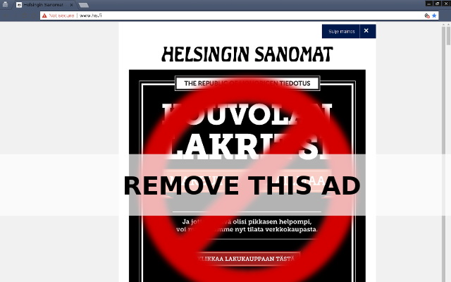

HSUX (Chrome Plugin)
==========================

Available in the [Chrome Web Store](https://chrome.google.com/webstore/detail/hs-ux-improvements/llbigclocjogefafobdgkcdpioikhbfa).

Removes annoying full-page ads from HS.fi (Helsingin Sanomat), if you're logged in to the 
site.

(Ie. removes class `frontpage-ad-visible` from `body` tag, if also 
`user-logged-in` class exists.)
